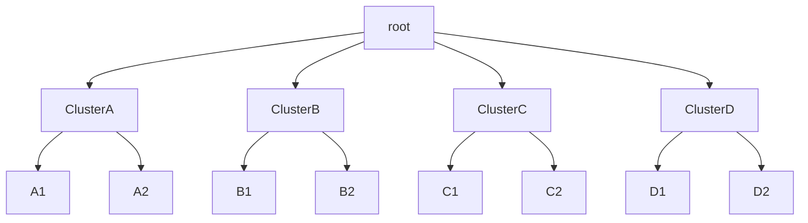
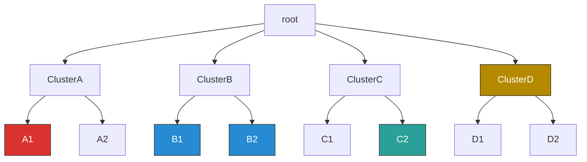

# Nexus Tree Tools

**Core purpose**: Bidirectional conversion between NEXUS tree files (used by FigTree) and JSON (jsTree format), with annotation enrichment along the way.
Java pipeline to convert and annotate phylogenetic NEXUS trees: parses NEXUS to JSON, adds hierarchical labels, and writes back to NEXUS and Newick formats
                                                                                                                            
**Pipeline:**

1. NEXUS → JSON (NexusToJstree.java) — parses a .nexus phylogenetic tree file and flattens it into a jsTree-compatible JSON, preserving node attributes like colors, highlights, branch lengths, and labels.                                     
2. JSON labeling (JstreeLabeler.java) — adds hierarchical labels (hier_label) to each node (e.g. 1.2.3) and color/highlight propagation from parent to child nodes.                                                                   
3. JSON → NEXUS (JstreeToNexus.java) — reconstructs an annotated .nexus file from the labeled JSON, also producing plain Newick (.nwk) and a peartree-compatible NEXUS variant.
                                                                                                                            
**Output formats:**

  - Labeled JSON with hierarchy metadata                                                                                    
  - TSV tables of all nodes             
  - Annotated NEXUS (FigTree)
  - Plain Newick (with/without quotes)                                                                                      
  - peartree-compatible NEXUS         
                                                                                                                     
---

## Quick and dirty

```bash
./main_example_launch.sh
```

where `main_example_launch.sh` contains:
```bash
./label_and_nexus.sh resources/WND_L1.nexus output
./label_and_nexus.sh resources/WND_L2.nexus output
```


`label_and_nexus.sh` — a shell script that compiles and runs the full pipeline in one shot on a given `.nexus` file. Here using the (example with WND_L2) input file in `resources/WND_L2.nexus`.

See the [flow diagram](docs/label_and_nexus_flow.md) for a visual overview of the pipeline.
                         


Compiles, labels and converts in one shot. Produces in `output/`:

- `WND_L2.json` — flat jstree JSON
- `WND_L2_labeled.json` — JSON with `hier_label`, `hier_label16`, `hier_label32`, `root_color`
- `WND_L2_labeled.tsv` — complete table of all nodes
- `WND_L2_labeled_root_colors.tsv` — root nodes only, by color
- `WND_L2_labeled_all_roots.tsv` — root nodes by color plus their ancestor chain (`root_ancestor`)
- `WND_L2_labeled.nexus` — annotated NEXUS (FigTree)
- `WND_L2_labeled.nwk` — plain Newick with quotes
- `WND_L2_labeled_noquote.nwk` — plain Newick without quotes
- `WND_L2_labeled_peartree.nexus` — peartree-compatible NEXUS (`[&key="val"]`)

---

## Main files

```
resources/
├── WND_L2.nexus             ← default NEXUS file
└── Giuliano_colours.nexus   ← default NEXUS file

src/
├── Main.java                ← CLI entry point
├── NexusToJstree.java       ← NEXUS → JSON jstree
├── JstreeLabeler.java       ← JSON → JSON + hierarchical label
└── JstreeToNexus.java       ← JSON → annotated NEXUS

output/                      ← generated automatically
```


## Build

```bash
mkdir -p bin
javac src/*.java -d bin
```

---

## Usage

### Full pipeline on default files

```bash
java -cp bin Main
```

Runs the pipeline on all `.nexus` files in `resources/` and saves results to `output/`.

---

### Individual commands

#### NEXUS → JSON jstree

```bash
java -cp bin Main nexus2json resources/WND_L2.nexus output/WND_L2.json
```

Each node becomes a flat object `{ id, parent, text, data: { color, hilight, label, branch_length, ... } }`.

---

#### JSON → JSON + hierarchical label

```bash
java -cp bin Main label output/WND_L2.json output/WND_L2_labeled.json
```

Adds `hier_label` to each node:

| Node        | hier_label |
|-------------|------------|
| Root        | `0`        |
| 1st child   | `1`        |
| 2nd child   | `2`        |
| child of 1  | `1.1`      |
| child of 2  | `2.1`      |

Alongside `hier_label`, the labeler also computes three encodings of it — `hier_label2`, `hier_label16` (prefixed `b16:`), `hier_label32` (prefixed `b32:`) — kept in the node data and exported to TSV/NEXUS. The root itself is left **without** these three: only `hier_label="0"` identifies it. They encode a *path* from the root, and the root has none — giving it a value would collide with the encoding of the first child (position 1 → digit `0`), as `hier_label2` on its own isn't a globally unique identifier, just a per-node code.

**`hier_label2`** — each dot-separated segment `s` of `hier_label` is converted independently:
- `s == 1` → `0`
- `s == 2` → `1`
- `s > 2` → `s - 1` written as 4-bit binary, digits separated by `.` (e.g. `3` → `2` → `0.0.1.0`, `5` → `4` → `0.1.0.0`)

**`hier_label16`** — `hier_label2` is split into blocks of 4 binary digits (left to right); each full block becomes one hex digit (`0`–`F`). If the last block has fewer than 4 digits, it is **not** zero-padded: it's appended as `.` + a prefix (indicating how many binary digits it holds) + the decimal/hex value of those digits:

| digits in last block | prefix | range        |
|-----------------------|--------|---------------|
| 1                      | `b` (binary)     | `b0`–`b1` |
| 2                      | `q` (quaternary) | `q0`–`q3` |
| 3                      | `o` (octal)      | `o0`–`o7` |

**`hier_label32`** — same scheme, blocks of 5 binary digits, full blocks → base32 digit (`0`–`9`, `A`–`V`). Same incomplete-last-block rule as `hier_label16`, plus:

| digits in last block | prefix | range |
|-----------------------|--------|-------|
| 4                      | `h` (hex) | `h0`–`hf` |

Example: `hier_label2 = 000000000000000100` →  `hier_label16 = b16:0001.q0`,  `hier_label32 = b32:000.o4`.

The labeling step also checks whether the tree is strictly binary. It prints a summary to the console — either confirming the tree is binary, or listing every node with more than 2 children (`hier_label`, sample text, child count):

```
    Struttura albero     : NON binario — 2 nodi con più di 2 diramazioni
        1.1.1        (n12)   -> 3 figli
        1.1.1.1.1    (n2045) -> 15 figli
```

Every node with more than 2 children also gets a `polytomy` attribute in its `data` block, whose value is the number of children. Being a regular `data` field, it flows through automatically to the labeled JSON, TSV and peartree NEXUS outputs — no separate handling needed.

**`root_color`** — for each distinct color value found in the input (`color` or `user_colour`, see [Annotation mapping](#annotation-mapping)), the labeler picks the node closest to the tree root carrying that color (shortest `hier_label`; ties broken lexicographically) and sets `root_color=<color>` on it.

**`root_ancestor`** — for every `root_color` node, the labeler then walks up its chain of predecessors (parent, grandparent, ...) and sets `root_ancestor="true"` on each one, stopping as soon as it reaches a node that is already marked — either an existing `root_color` node or one already flagged `root_ancestor` — or after marking the true tree root. This means a predecessor shared by multiple colored roots is only walked/marked once.

Both are regular `data` fields and flow through to JSON/TSV/NEXUS like any other attribute. Two dedicated TSV exports are also produced:
- `_root_colors.tsv` — only the `root_color` nodes (one per distinct color)
- `_all_roots.tsv` — the `root_color` nodes **plus** their `root_ancestor` predecessors

---

#### JSON → reconstructed NEXUS

```bash
java -cp bin Main json2nexus output/WND_L2_labeled.json output/WND_L2_reconstructed.nexus
```

---

#### JSON → TSV

```bash
java -cp bin Main json2tsv output/WND_L2_labeled.json output/WND_L2_labeled.tsv
```

Exports every node as a row with fixed columns `id`, `parent`, `text` followed by all fields in the `data` block.

```
id    parent  text      color    hier_label  ...
n0    #       n0                 0
n1    n0      SampleA   #ff0000  1
```

The output is directly usable as input to `tsv2json`.

---

#### TSV → JSON jstree

```bash
java -cp bin Main tsv2json output/WND_L2_labeled.tsv output/WND_L2_from_tsv.json
```

Reconstructs a jstree JSON from a TSV produced by `json2tsv`. Columns `id`, `parent`, `text` become top-level node fields; all other columns go into the `data` block. If `text` is missing it falls back to `id`.

---

#### JSON + TSV → JSON enriched with attributes

```bash
java -cp bin Main enrich output/WND_L2_labeled.json attrs.tsv output/WND_L2_enriched.json
```

Merges attributes from a TSV into the `data` block of matching nodes (matched by `id`). Adds new attributes, overwrites existing ones.

The TSV must have a header row with an `id` column and one or more attribute columns:

```
id	attribute1	attribute2
n3	value_a	value_b
n7	value_c	
```

---

#### Full pipeline on a single file

```bash
java -cp bin Main pipeline resources/WND_L2.nexus output/
```

Produces in `output/`:
- `WND_L2.json`
- `WND_L2_labeled.json`
- `WND_L2_reconstructed.nexus`

---

### Help

```bash
java -cp bin Main help
```

---

## Annotation mapping

| Field in `data`      | Newick annotation         |
|----------------------|---------------------------|
| `color`              | `[&!color=#rrggbb]`       |
| `hilight`            | `[&!hilight={n,v,#color}]`|
| `label`              | `[&label=N]`              |
| `annotation_name`    | `[&!name="value"]`        |
| other custom fields  | `[&!key=value]`           |
| `branch_length`      | `:value`                  |
| `hier_label`         | ignored                   |

---

## Example

A toy phylogenetic tree with 4 clusters (`A`, `B`, `C`, `D`), each with 2 leaves, hanging off a root with 4 direct children (a polytomy). No node is colored yet:



An expert examines the tree and colors the nodes that identify each cluster — not necessarily the same way for each: on `A` and `C` only one representative leaf is colored, on `B` both leaves are colored, and on `D` the internal node itself is colored instead of its leaves:



This second tree, with the color annotations, is the pipeline's **input**. As NEXUS (`[&!color=#rrggbb]` annotation, see [Annotation mapping](#annotation-mapping)):

```
#NEXUS
BEGIN TREES;
	tree TREE1 = [&R] ((A1[&!color=#dc322f]:1,A2:1)ClusterA:1,(B1[&!color=#268bd2]:1,B2[&!color=#268bd2]:1)ClusterB:1,(C1:1,C2[&!color=#2aa198]:1)ClusterC:1,(D1:1,D2:1)ClusterD[&!color=#b58900]:1);
end;
```

From here on, the algorithm (`label`) processes the tree in these steps. All the values shown are the real output obtained by running the pipeline on this file.

### 1. Root node per color (`root_color`)

For each distinct color found in the tree, the node with the shortest `hier_label` (closest to the root) is chosen; ties are broken by the lexicographically smaller one:

| Color | Nodes with that color | Chosen node (`root_color`) | `hier_label` | Why |
|---|---|---|---|---|
| `#dc322f` | A1 | **A1** | `1.1` | only node with that color |
| `#268bd2` | B1, B2 | **B1** | `2.1` | `2.1` and `2.2` have the same length → `2.1` wins (lexicographically smaller) |
| `#2aa198` | C2 | **C2** | `3.2` | only node with that color |
| `#b58900` | ClusterD | **ClusterD** | `4` | the color was applied directly to the internal node, not to a leaf |

### 2. Predecessors of the root nodes (`root_ancestor`)

For each `root_color` node, the parent→grandparent→... chain is walked upward, setting `root_ancestor="true"`, stopping at the first node that is already marked (whether it's itself a `root_color` node or already flagged `root_ancestor`) or after marking the true root. The four `root_color` nodes are processed in the order they appear in the tree (A1, B1, C2, ClusterD):

| Order | Root node | Walk | Nodes marked `root_ancestor` |
|---|---|---|---|
| 1 | A1 (`1.1`) | parent `ClusterA` (unmarked) → parent `root` (unmarked) → root reached, stop | `ClusterA`, `root` |
| 2 | B1 (`2.1`) | parent `ClusterB` (unmarked) → parent `root` (**already marked at step 1**), stop | `ClusterB` |
| 3 | C2 (`3.2`) | parent `ClusterC` (unmarked) → parent `root` (already marked), stop | `ClusterC` |
| 4 | ClusterD (`4`) | parent `root` (already marked), stop immediately | *(none)* |

Result: 4 `root_color` nodes + 4 `root_ancestor` nodes (`root`, `ClusterA`, `ClusterB`, `ClusterC`) — exported respectively to `_root_colors.tsv` and, combined, to `_all_roots.tsv` (8 rows).

### 3. Binary path (`hier_label2`) and handling polytomies

`hier_label2` encodes each dot-separated segment `s` of `hier_label` (the 1-based position of the child within its parent) as follows: `s-1` if ≤ 1 (single digit `0`/`1`), otherwise `s-1` as **4-bit** binary. The root of this example has 4 children instead of 2 (a polytomy, flagged with `polytomy="4"` as described above): the first two are still encoded on a single bit, but from the third child onward the 4-bit block is needed, because a single bit can only distinguish 2 alternatives:

| Root's child | position `s` | `s-1` | `hier_label2` segment |
|---|---|---|---|
| ClusterA | 1 | 0 | `0` (single digit) |
| ClusterB | 2 | 1 | `1` (single digit) |
| ClusterC | 3 | 2 | `0.0.1.0` (4-bit binary of 2) |
| ClusterD | 4 | 3 | `0.0.1.1` (4-bit binary of 3) |

The `hier_label2` of any node is the concatenation of the segments of all its ancestors: for example `C1` has `hier_label="3.1"` → segment `"3"` → `0.0.1.0`, segment `"1"` → `0` → `hier_label2 = 0.0.1.0.0`.

### 4. Encoding into `hier_label16` / `hier_label32`

`hier_label2` is grouped into blocks of 4 digits (for `hier_label16`) or 5 digits (for `hier_label32`); a full block becomes a hex/base32 digit, an incomplete final block becomes `.` + a prefix (`b`/`q`/`o`/`h` depending on how many digits remain, see the table in the previous section) + the value — **without** padding:

| Node | `hier_label2` | `hier_label16` | `hier_label32` |
|---|---|---|---|
| root | *(empty)* | *(empty)* | *(empty)* |
| ClusterA | `0` | `b16:0` | `b32:0` |
| A1 | `0.0` | `b16:.q0` | `b32:.q0` |
| ClusterB | `1` | `b16:.b1` | `b32:.b1` |
| B1 | `1.0` | `b16:.q2` | `b32:.q2` |
| ClusterC | `0.0.1.0` | `b16:2` | `b32:.h2` |
| C1 | `0.0.1.0.0` | `b16:2.b0` | `b32:4` |
| ClusterD | `0.0.1.1` | `b16:3` | `b32:.h3` |

Notes:
- **`root`** gets no `hier_label2`/`16`/`32` at all — only `hier_label="0"` identifies it. Note that `ClusterA`, its first child, independently lands on `"0"` too (position 1 → digit `0`, per the rule below): if the root were also assigned `"0"`, the two would be indistinguishable by `hier_label2` alone. Leaving the root's code empty avoids that collision.
- **`ClusterC`** has exactly 4 binary digits: for `hier_label16` (blocks of 4) this is a full block → single hex digit `2`, no dot. For `hier_label32` (blocks of 5) the same block is incomplete (4 out of 5 digits) → `.h2` (`h` = 4 remaining digits, hex value).
- **`C1`** has 5 binary digits (`0.0.1.0.0`): for `hier_label16` the first 4-digit block is full (`2`), leaving 1 digit (`0`) → suffix `.b0` (`b` = 1 remaining digit). For `hier_label32` those same 5 digits exactly fill one block → no suffix, just the base32 digit for value 4.
- **`A1`** has only 2 binary digits (`0.0`): too few for a full block at either 4 or 5 digits → in both cases it becomes `.q0` (`q` = 2 remaining digits), with the leading dot because there's no full block before it.

This tree doesn't happen to show a 3-digit final block (`o` suffix), but the rule is identical: see the full table in the [`hier_label16`/`hier_label32`](#json--json--hierarchical-label) section above.

---

## VS Code

Open the `nexus-tree-tools/` folder in VS Code.  
The project comes preconfigured with seven debug configurations in `.vscode/launch.json`:

- **Default pipeline** — pipeline on both default files
- **Pipeline on WND_L2.nexus**
- **Pipeline on Giuliano_colours.nexus**
- **nexus2json only** / **label only** / **json2nexus only** — individual steps
- **Show help**

Press `F5` or open *Run and Debug* (`Ctrl+Shift+D`) and choose a configuration.

> **Prerequisite**: *Extension Pack for Java* extension (`vscjava.vscode-java-pack`).
