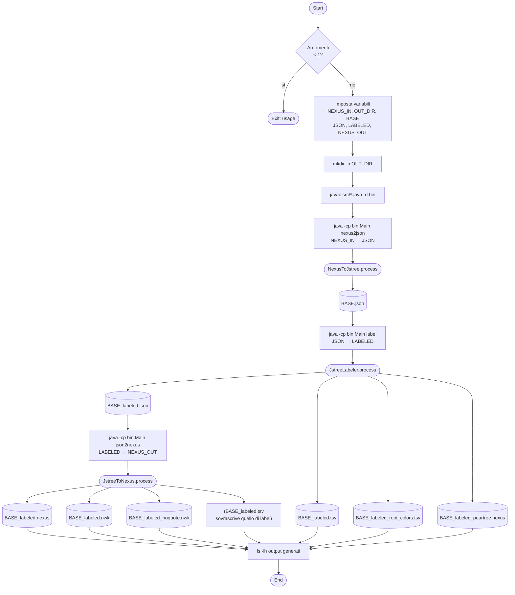

# Flusso di `label_and_nexus.sh`

```mermaid
flowchart TD
    A([Start]) --> B{Argomenti\n< 1?}
    B -- sì --> C([Exit: usage])
    B -- no --> D["Imposta variabili\nNEXUS_IN, OUT_DIR, BASE\nJSON, LABELED, NEXUS_OUT"]
    D --> E[mkdir -p OUT_DIR]
    E --> F["javac src/*.java -d bin"]

    F --> G["java -cp bin Main nexus2json\nNEXUS_IN → JSON"]
    G --> H([NexusToJstree.process])
    H --> F1[(BASE.json)]

    F1 --> I["java -cp bin Main label\nJSON → LABELED"]
    I --> J([JstreeLabeler.process])
    J --> L1[(BASE_labeled.json)]
    J --> L2[(BASE_labeled.tsv)]
    J --> L3[(BASE_labeled_root_colors.tsv)]
    J --> L4[(BASE_labeled_peartree.nexus)]

    L1 --> K["java -cp bin Main json2nexus\nLABELED → NEXUS_OUT"]
    K --> M([JstreeToNexus.process])
    M --> N1[(BASE_labeled.nexus)]
    M --> N2[(BASE_labeled.nwk)]
    M --> N3[(BASE_labeled_noquote.nwk)]
    M --> N4["(BASE_labeled.tsv\n sovrascrive quello di label)"]

    N1 & N2 & N3 & N4 & L2 & L3 & L4 --> O["ls -lh output generati"]
    O --> P([End])
```
